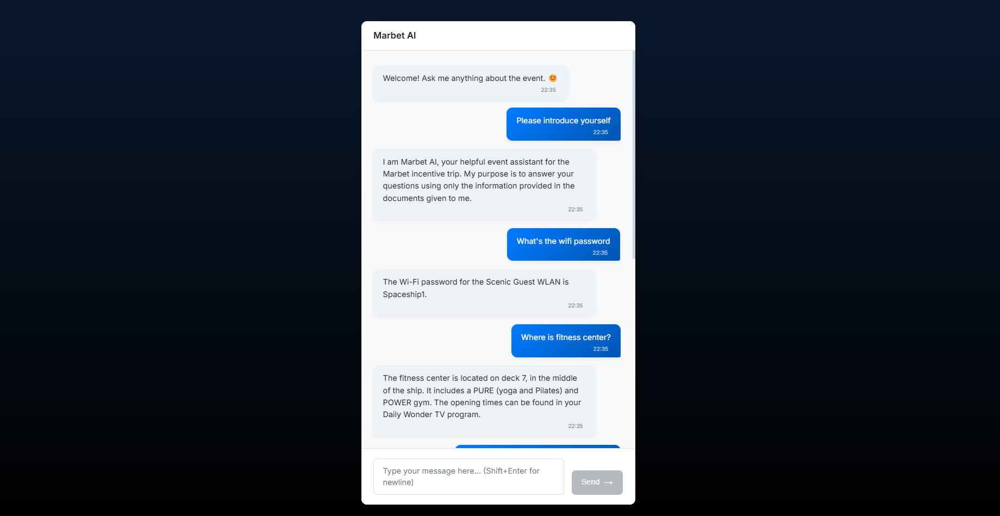
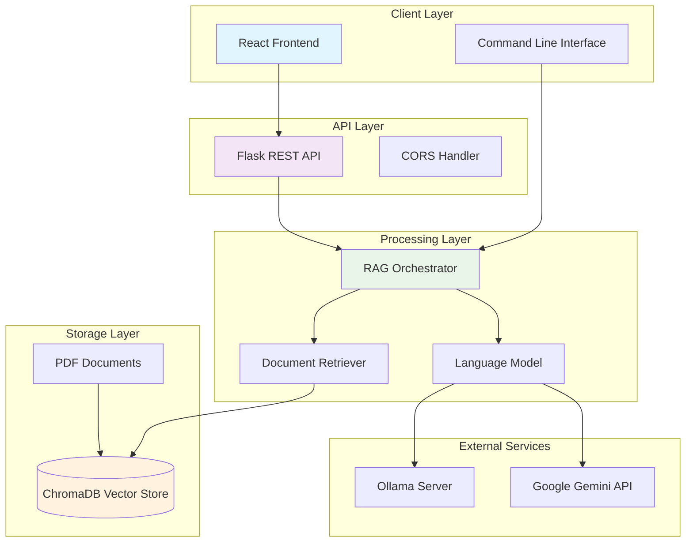

<div align="center">

# Marbet AI Event Assistant

[](https://python.org)
[](https://langchain.com)
[](https://reactjs.org)
[](LICENSE)

### A Retrieval-Augmented Generation (RAG) chatbot for intelligent event assistance



*Combining document retrieval with large language models to deliver accurate, source-grounded responses*


</div>


## Table of Contents

<details>
<summary><strong>Navigation</strong></summary>

1. [Overview](#overview)
2. [Key Features](#key-features)
3. [System Architecture](#system-architecture)
4. [Technology Stack](#technology-stack)
5. [Quick Start](#quick-start)
6. [Installation](#installation)
7. [Configuration](#configuration)
8. [Usage](#usage)
9. [API Reference](#api-reference)
10. [Development](#development)
11. [Contributing](#contributing)
12. [License](#license)

</details>


## Overview

The Marbet AI Event Assistant is a **Retrieval-Augmented Generation (RAG)** system that provides accurate, context-aware responses to user queries by leveraging a curated collection of event documents. The system ensures factual accuracy by grounding all responses in the provided source material, eliminating hallucinations commonly found in standalone language models.

Built with modularity and flexibility in mind, the system supports both local and cloud-based language models, making it suitable for various deployment scenarios and security requirements.


## System Architecture



### Data Flow

1. **Document Ingestion**: PDF files are processed, chunked, and converted to vector embeddings
2. **Query Processing**: User queries are received via web UI or CLI
3. **Context Retrieval**: Relevant document chunks are retrieved from the vector store
4. **Response Generation**: LLM generates contextual responses using retrieved information
5. **Result Delivery**: Answers with source citations are returned to the user


## Quick Start

<div align="center">

**Get up and running in under 5 minutes**

</div>

### Prerequisites Check
```bash
# Verify Python version (3.9+ required)
python --version

# Verify Node.js version (16+ required)  
node --version

# Check if Tesseract is installed
tesseract --version
```

### Installation & Setup

<details>
<summary><strong>Step 1: Clone Repository</strong></summary>

```bash
git clone https://github.com/soheil-mp/event-assistant-llm.git
cd event-assistant-llm
```

</details>

<details>
<summary><strong>Step 2: Backend Setup</strong></summary>

```bash
# Create and activate virtual environment
python -m venv venv

# Windows
.\venv\Scripts\activate

# macOS/Linux  
source venv/bin/activate

# Install dependencies
pip install -r requirements.txt
```

</details>

<details>
<summary><strong>Step 3: Frontend Setup</strong></summary>

```bash
cd frontend
npm install
cd ..
```

</details>

<details>
<summary><strong>Step 4: Environment Configuration</strong></summary>

Create `.env` file in project root:

```env
# LLM Provider Selection
LLM_SOURCE="gemini"  # or "ollama"

# Google Gemini Configuration (if using cloud)
GEMINI_API_KEY="your_api_key_here"
GEMINI_LLM_MODEL="gemini-1.5-flash-latest"

# Ollama Configuration (if using local)
OLLAMA_BASE_URL="http://localhost:11434"
OLLAMA_LLM_MODEL="deepseek-r1:32b"
```

</details>

<details>
<summary><strong>Step 5: Add Documents & Launch</strong></summary>

```bash
# Add your PDF documents
cp your-documents/*.pdf data/documents/

# Start backend (processes documents on first run)
python api.py

# Start frontend (in new terminal)
cd frontend && npm run dev
```

**Access at:** `http://localhost:5173`

</details>


## Installation

### System Requirements

<table>
<tr>
<td><strong>Platform</strong></td>
<td>Windows 10+, macOS 10.15+, Ubuntu 18.04+</td>
</tr>
<tr>
<td><strong>Python</strong></td>
<td>3.9.0 or higher</td>
</tr>
<tr>
<td><strong>Node.js</strong></td>
<td>16.0.0 or higher</td>
</tr>
<tr>
<td><strong>Memory</strong></td>
<td>4GB RAM minimum, 8GB recommended</td>
</tr>
<tr>
<td><strong>Storage</strong></td>
<td>2GB free space for dependencies and vector store</td>
</tr>
</table>

### Tesseract OCR Installation

<details>
<summary><strong>Windows Installation</strong></summary>

1. Download installer from [Tesseract at UB Mannheim](https://github.com/UB-Mannheim/tesseract/wiki)
2. Run installer with default settings
3. Add installation path to system PATH: `C:\Program Files\Tesseract-OCR`
4. Verify installation: `tesseract --version`

</details>

<details>
<summary><strong>macOS Installation</strong></summary>

```bash
# Using Homebrew (recommended)
brew install tesseract

# Verify installation
tesseract --version
```

</details>

<details>
<summary><strong>Linux Installation</strong></summary>

```bash
# Ubuntu/Debian
sudo apt-get update
sudo apt-get install tesseract-ocr tesseract-ocr-eng

# CentOS/RHEL/Fedora
sudo yum install tesseract tesseract-langpack-eng

# Verify installation
tesseract --version
```

</details>


## Configuration

### Environment Setup

The application uses environment variables for configuration. Create a `.env` file in the project root:

<details>
<summary><strong>Google Gemini Configuration (Cloud)</strong></summary>

```env
# LLM Provider
LLM_SOURCE="gemini"

# Gemini API Settings
GEMINI_API_KEY="your_api_key_here"
GEMINI_LLM_MODEL="gemini-1.5-flash-latest"
GEMINI_EMBEDDING_MODEL="models/embedding-001"

# General Settings
LLM_TEMPERATURE="0.0"
CHUNK_SIZE="128"
CHUNK_OVERLAP="20"
RETRIEVER_K="100"
FORCE_REBUILD_VECTOR_STORE="False"
```

**Setup Instructions:**
1. Visit [Google AI Studio](https://makersuite.google.com/app/apikey)
2. Create a new API key
3. Add the key to your `.env` file

</details>

<details>
<summary><strong>Ollama Configuration (Local)</strong></summary>

```env
# LLM Provider
LLM_SOURCE="ollama"

# Ollama Settings
OLLAMA_BASE_URL="http://localhost:11434"
OLLAMA_LLM_MODEL="deepseek-r1:32b"
EMBEDDING_MODEL="mxbai-embed-large:latest"

# General Settings
LLM_TEMPERATURE="0.0"
CHUNK_SIZE="128"
CHUNK_OVERLAP="20"
RETRIEVER_K="100"
FORCE_REBUILD_VECTOR_STORE="False"
```

**Setup Instructions:**
1. Install [Ollama](https://ollama.ai)
2. Pull required models:
   ```bash
   ollama pull deepseek-r1:32b
   ollama pull mxbai-embed-large:latest
   ```
3. Start Ollama server: `ollama serve`

</details>

### Configuration Parameters

| Parameter | Description | Default | Options |
|:----------|:------------|:--------|:--------|
| `LLM_SOURCE` | Language model provider | `gemini` | `gemini`, `ollama` |
| `GEMINI_API_KEY` | Google Gemini API key | - | Your API key |
| `OLLAMA_BASE_URL` | Ollama server endpoint | `http://localhost:11434` | Valid URL |
| `CHUNK_SIZE` | Document chunk size | `128` | 64-512 tokens |
| `CHUNK_OVERLAP` | Overlap between chunks | `20` | 10-50 tokens |
| `RETRIEVER_K` | Documents to retrieve | `100` | 10-200 |
| `FORCE_REBUILD_VECTOR_STORE` | Force vector store rebuild | `False` | `True`, `False` |

### Document Management

Add your PDF documents to the `data/documents/` directory. The system will automatically:
- Process new documents on startup
- Extract text using OCR when needed
- Create vector embeddings
- Store them in the local ChromaDB instance


## Usage

### Web Interface

<table>
<tr>
<td width="50%">

**Starting the Application**

```bash
# Terminal 1: Start backend API
python api.py

# Terminal 2: Start frontend  
cd frontend
npm run dev
```

**First Run Notes:**
- Document processing occurs automatically
- Vector store creation may take several minutes
- Monitor console output for progress

</td>
<td width="50%">

**Using the Interface**

1. **Access**: Navigate to `http://localhost:5173`
2. **Chat**: Type questions about your event documents
3. **Sources**: View document citations in responses
4. **History**: Previous conversations are maintained

**Example Queries:**
- "What time does registration start?"
- "Where is the welcome reception?"
- "What should I bring to the event?"

</td>
</tr>
</table>

### Command Line Interface

For development and testing purposes:

```bash
python main.py
```

**Interactive Session:**
```
--- Marbet Event Assistant CLI Ready ---
Ask questions about the event (type 'quit' to exit).

Assistant: Parking is available in the adjacent parking structure.
Level B1 is reserved for event attendees with validation.

Retrieved Sources:
- Event_Logistics.pdf, Page 3: "Parking structure - Level B1 reserved"
```


## API Reference

### Chat Endpoint

**`POST /api/chat`**

Send a message to the chatbot and receive an AI-generated response with source attribution.

<details>
<summary><strong>Request Format</strong></summary>

```http
POST /api/chat
Content-Type: application/json

{
  "message": "string",
  "history": [
    {
      "sender": "user|ai",
      "text": "string"
    }
  ]
}
```

**Parameters:**
- `message` (required): The user's question or query
- `history` (optional): Array of previous conversation messages

</details>

<details>
<summary><strong>Response Format</strong></summary>

```http
HTTP/1.1 200 OK
Content-Type: application/json

{
  "answer": "string",
  "retrieved_context": [
    {
      "metadata": {
        "source": "document.pdf",
        "page": 1
      }
    }
  ],
  "has_citations": true
}
```

**Response Fields:**
- `answer`: The generated response text
- `retrieved_context`: Metadata for documents used in the response
- `has_citations`: Boolean indicating if sources were found and cited

</details>

<details>
<summary><strong>Error Responses</strong></summary>

```http
HTTP/1.1 400 Bad Request
{
  "error": "Missing 'message' in request body"
}

HTTP/1.1 500 Internal Server Error
{
  "error": "Chatbot is not initialized. Please check server logs."
}
```

</details>

### Example Usage

<details>
<summary><strong>Python Example</strong></summary>

```python
import requests

# Basic chat request
response = requests.post('http://localhost:5000/api/chat', json={
    'message': 'What time does the event start?',
    'history': []
})

if response.status_code == 200:
    data = response.json()
    print(f"Answer: {data['answer']}")
    print(f"Has citations: {data['has_citations']}")
else:
    print(f"Error: {response.status_code}")
```

</details>

<details>
<summary><strong>JavaScript Example</strong></summary>

```javascript
const response = await fetch('http://localhost:5000/api/chat', {
  method: 'POST',
  headers: {
    'Content-Type': 'application/json',
  },
  body: JSON.stringify({
    message: 'What time does the event start?',
    history: []
  })
});

const data = await response.json();
console.log('Answer:', data.answer);
```

</details>


## API Reference

### `POST /api/chat`

Handles chat requests.

**Request Body:**
```json
{
  "message": "string",
  "history": [
    {"sender": "user", "text": "string"},
    {"sender": "ai", "text": "string"}
  ]
}
```

**Success Response (200 OK):**
```json
{
  "answer": "string",
  "retrieved_context": [
    {
      "metadata": {
        "source": "string",
        "page": "number"
      }
    }
  ],
  "has_citations": "boolean"
}
```

**Error Responses:**
- `400 Bad Request`: If the `message` field is missing.
- `500 Internal Server Error`: If the chatbot fails to initialize or an error occurs during processing.


## Development

## Development

### Project Structure

```
event-assistant-llm/
├── 📁 src/marbet_rag/          # Core RAG implementation
│   ├── __init__.py             # Package initialization
│   ├── data_processing.py      # Document loading and chunking
│   ├── retrieval.py           # Vector store and RAG chain setup
│   ├── prompts.py             # System prompts and templates
│   └── utils.py               # Helper functions and utilities
├── 📁 frontend/                # React web interface
│   ├── 📁 src/                # React source code
│   │   ├── 📁 components/     # UI components
│   │   ├── App.jsx            # Main application component
│   │   └── main.jsx           # Application entry point
│   ├── 📁 public/             # Static assets
│   ├── package.json           # Frontend dependencies
│   └── vite.config.js         # Vite configuration
├── 📁 data/                   # Data directory
│   ├── 📁 documents/          # Source PDF documents
│   └── 📁 vector_store/       # Generated ChromaDB storage
├── 📁 assets/                 # Demo images and documentation assets
├── 📁 notebooks/              # Jupyter notebooks for experimentation
├── api.py                     # Flask API server
├── main.py                    # CLI interface
├── config.py                  # Configuration management
├── requirements.txt           # Python dependencies
└── README.md                  # Project documentation
```

### Development Workflow

<table>
<tr>
<td width="50%">

**Setup Development Environment**

```bash
# Clone repository
git clone <repository-url>
cd event-assistant-llm

# Setup Python environment
python -m venv venv
source venv/bin/activate  # Windows: .\venv\Scripts\activate
pip install -r requirements.txt

# Setup frontend
cd frontend
npm install
cd ..
```

</td>
<td width="50%">

**Development Commands**

```bash
# Start backend in development mode
python api.py

# Start frontend with hot reload
cd frontend && npm run dev

# Run CLI for testing
python main.py

# Build frontend for production
cd frontend && npm run build
```

</td>
</tr>
</table>

### Testing

<details>
<summary><strong>Running Tests</strong></summary>

```bash
# Install test dependencies
pip install pytest pytest-cov

# Run all tests
python -m pytest

# Run with coverage
python -m pytest --cov=src

# Run specific test file
python -m pytest tests/test_rag.py -v
```

</details>

### Code Quality

<details>
<summary><strong>Linting and Formatting</strong></summary>

```bash
# Python code formatting
pip install black flake8
black src/ --line-length 88
flake8 src/ --max-line-length 88

# JavaScript/React linting
cd frontend
npm run lint
npm run lint:fix
```

</details>


## Technology Stack

<div align="center">

### Backend Technologies
| Component | Technology | Purpose |
|:---------:|:----------:|:--------|
| **Runtime** |  | Core application runtime |
| **Framework** |  | RAG pipeline orchestration |
| **API Server** |  | RESTful web services |
| **Vector DB** |  | Document embeddings storage |
| **OCR Engine** |  | Text extraction from PDFs |

### Frontend Technologies
| Component | Technology | Purpose |
|:---------:|:----------:|:--------|
| **UI Library** |  | User interface components |
| **Build Tool** |  | Development and build system |
| **HTTP Client** |  | API communication |

### AI/ML Services
| Service | Provider | Integration |
|:-------:|:--------:|:-----------:|
| **Local LLM** |  | Self-hosted language models |
| **Cloud LLM** |  | Google Generative AI API |

</div>